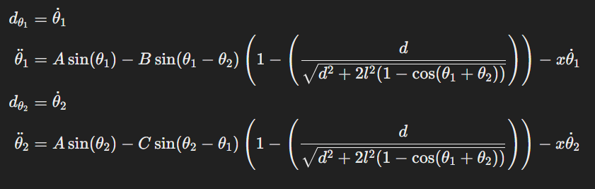
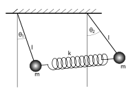

# SpringCoupledPendulum

This is a simple simulation of a spring coupled pendulum. the physics of the system is described by the following equations:

Schematic of the system:

The spring is connected to the two masses and the spring constant is k. the length of the pendulum is l and the masses are m1 and m2. the angle of the pendulum is theta1 and theta2. the angular velocity of the pendulum is dot_theta1 and dot_theta2. the distance between the two masses is d. the acceleration due to gravity is g. The damping coefficient is x to account for air resistance.

The two masses are connected to a pivot point by a massless rod. The rod is assumed to be rigid and the masses are assumed to be point masses. The rod is assumed to be massless and the spring is assumed to be massless.  

A problem occured after a certain amount of simulation time, I think it's because of the equations of motion.It says :'Excess work done on this call (perhaps wrong Dfun type).' line 153[sol, info = odeint(G_adim, y0, [0, t], full_output=True)] . I would appreciate it if someone could help me with this.